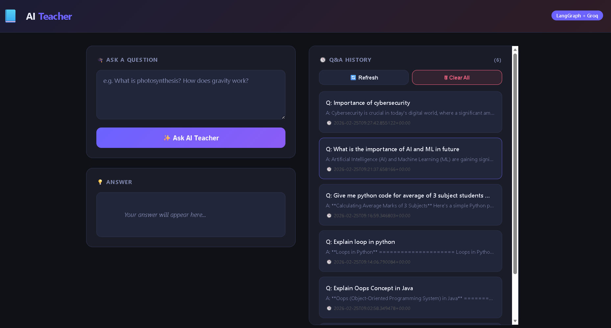
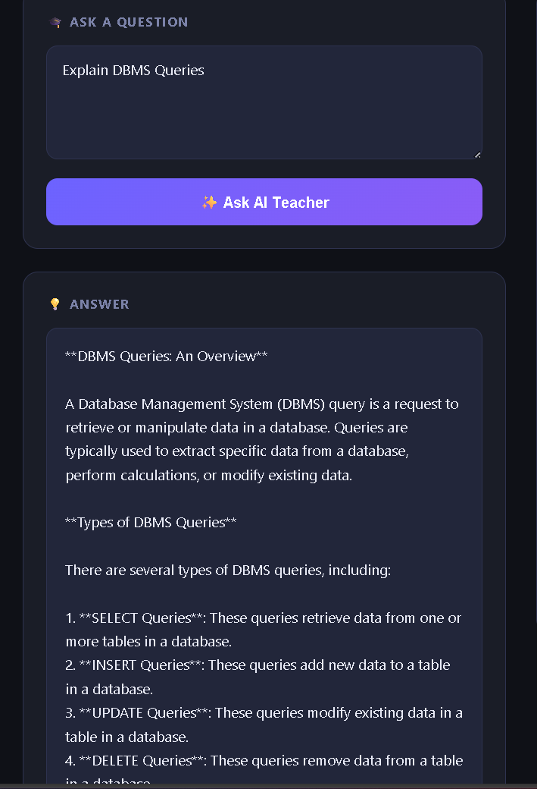
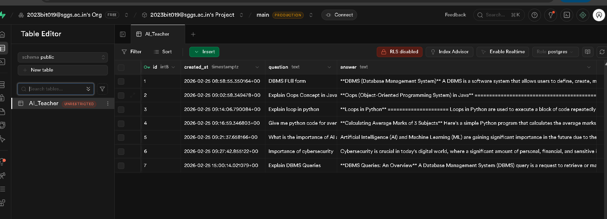

# 🤖 AI Teacher – Intelligent Q&A System with Cloud Database Integration

AI Teacher is a full-stack AI-powered web application that allows users to ask questions in real-time and receive instant AI-generated responses using Groq LLaMA 3.1 — while securely storing all interactions in a Supabase cloud database.

This project demonstrates real-world integration of LLMs with backend systems and cloud storage.

---

## 🚀 Project Overview

AI Teacher combines:

- 🧠 Groq LLaMA 3.1 for ultra-fast AI inference
- 🌐 Flask backend for API handling
- 🗄️ Supabase PostgreSQL for persistent cloud storage
- 📡 REST-based communication
- 🔐 Secure environment variable configuration
- 📊 Chat history management with timestamps

---

## 📸 UI Preview

### 🏠 Home Interface

### 💬 AI Response Example

### 📜 Chat History

### 🗄️ Supabase Cloud Database (AI_Teacher Table)

## ✨ Key Features

- 💬 Ask any question in real-time
- ⚡ Instant AI-generated responses
- 🗄️ Store question-answer history in Supabase
- 🕒 Timestamp-based logging
- 📜 Load previous chat history
- 🗑️ Clear chat history endpoint
- 📡 REST API structure
- 🌐 CORS enabled for frontend integration

---

## 🛠️ Tech Stack

| Technology     | Purpose                   |
| -------------- | ------------------------- |
| Flask          | Backend Web Framework     |
| Groq LLaMA 3.1 | Large Language Model      |
| LangChain      | LLM Integration           |
| Supabase       | Cloud PostgreSQL Database |
| Flask-CORS     | Cross-Origin Support      |
| HTML + CSS     | Frontend UI               |
| Python         | Core Language             |

---

## 🏗️ System Architecture

User → Flask API → Groq LLM →  
Response Generated →  
Store in Supabase →  
Return JSON Response

Additional Endpoints:

- GET /history → Load chat history
- DELETE /history → Clear chat history

---

## 📂 Project Structure

AI-Teacher-QA-System/
│
├── test_supabase.py
├── templates/
│ └── index.html
├── requirements.txt
├── .env (ignored)
├── credentials.json (ignored)
├── .gitignore
└── README.md

---

## 🔐 Environment Variables

Create a `.env` file:

GROQ_API_KEY=your_groq_api_key  
SUPABASE_URL=your_supabase_url  
SUPABASE_KEY=your_supabase_key

⚠ These files are excluded using `.gitignore` for security.

---

## ▶️ Run Locally

### 1️⃣ Clone Repository

git clone https://github.com/YOUR_USERNAME/AI-Teacher-QA-System.git

### 2️⃣ Navigate to Folder

cd AI-Teacher-QA-System

### 3️⃣ Create Virtual Environment

python -m venv venv  
venv\Scripts\activate

### 4️⃣ Install Dependencies

pip install -r requirements.txt

### 5️⃣ Run Application

python test_supabase.py

App will open at:

http://127.0.0.1:5000

---

## 📡 API Endpoints

### POST /ask

Request:

{
"question": "What is Artificial Intelligence?"
}

Response:

{
"answer": "...",
"duration_ms": 245,
"saved_to_sheet": true
}

---

### GET /history

Returns all stored questions and answers.

---

### DELETE /history

Clears entire chat history.

---

## 🧠 What I Learned

- Integrating LLM APIs with backend systems
- Designing database-connected AI applications
- Handling REST API routing in Flask
- Cloud database integration using Supabase
- Secure API key handling
- Measuring AI response performance
- Structuring full-stack AI projects professionally

---

## 🎯 Future Improvements

- Add authentication system
- Add user-based chat sessions
- Add pagination to history
- Deploy on Render / Railway
- Add rate limiting
- Improve UI with Tailwind CSS

---

## 👩‍💻 Author

Kshitija More  
B.Tech IT | AI & Backend Developer  
Building production-style AI systems 🚀

---

⭐ If you like this project, give it a star!
